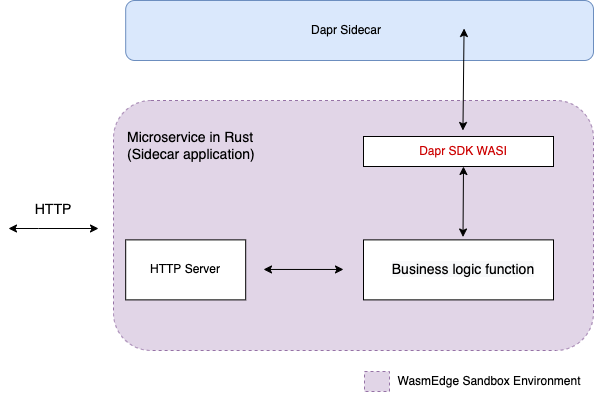

# Dapr SDK for WebAssembly

Written in Rust, the *dapr_sdk_wasi* crate can be compiled into WebAssembly and runs in the [WasmEdge Runtime](https://github.com/wasmedge).

[Introduction](#introduction) | [How it works](#how-it-works) | [Contribution](#contribution)

## Introduction

> This software is still under development, we [welcome new contributors](#contribution)!

WebAssembly provides a secure, fast, and lightweight runtime sandbox for cloud-native applications, especially for [microservices](https://github.com/second-state/microservice-rust-mysql), as [an alternative to Linux containers and VMs](https://wasmedge.org/wasm_linux_container/). The *dapr_sdk_wasi* crate is a Rust SDK for the [Dapr framework](https://dapr.io/). It provides an easy way for Rust-based microservices in WasmEdge to interact with Dapr APIs and sidecar services. The figure below shows a Dapr-enabled microservice running inside the WasmEdge sandbox.



Currently, the dapr-sdk-wasi supports Dapr's service invocation, state management, secrets, and health APIs.


| Dapr API               | Status     |
|------------------------|------------|
| Service invocation API | ✅          |
| State management API   | ✅          |
| Pub/sub API            | To be done |
| Bindings API           | To be done |
| Actors API             | To be done |
| Secrets API            | ✅          |
| Configuration API      | To be done |
| Distributed Lock API   | To be done |
| Health API             | ✅          |
| Metadata API           | To be done |


## How it works

This repo contains the SDK, a Dapr service example, and an example client to access the Dapr service using the SDK.

* The root project is the SDK, which is provides a Rust API to call Dapr API services.
* `examples/echo` is a microservice demo that runs with a Dapr sidecar.
* `examples/tests` is a SDK client that accesses Dapr APIs on the sidecar.

If you want to run the `echo` example and SDK tests, follow the following instructions.

### Install Rust and add Wasi target for the Rust compiler

```
curl --proto '=https' --tlsv1.2 -sSf https://sh.rustup.rs | sh
rustup target add wasm32-wasi
```

### Install WasmEdge

```
curl -sSf https://raw.githubusercontent.com/WasmEdge/WasmEdge/master/utils/install.sh | bash
```

### Install and init Dapr

```
wget -q https://raw.githubusercontent.com/dapr/cli/master/install/install.sh -O - | /bin/bash
dapr init
```

### Run the `echo` example

```
cd examples/echo

// compile the rust code to wasm 
cargo build --target wasm32-wasi --release
wasmedgec target/wasm32-wasi/release/dapr_echo.wasm dapr_echo.wasm

// Use Dapr to start the echo microservice application
dapr run --app-id echo-service --app-protocol http --app-port 9004 --dapr-http-port 3502 --components-path ../config --log-level debug wasmedge dapr_echo.wasm

// Shows the server log
ℹ️  Starting Dapr with id echo-service. HTTP Port: 3502. gRPC Port: 44517
time="2022-10-07T22:00:17.732779744Z" level=info msg="starting Dapr Runtime -- version 1.8.4 -- commit 18575823c74318c811d6cd6f57ffac76d5debe93" app_id=echo-service instance=fv-az186-200 scope=dapr.runtime type=log ver=1.8.4
time="2022-10-07T22:00:17.732813444Z" level=info msg="log level set to: debug" app_id=echo-service instance=fv-az186-200 scope=dapr.runtime type=log ver=1.8.4
···
```

### Run the SDK tests

Do the following from another terminal window from the `echo` service.

```
cd examples/tests

// compile the SDK testing code to wasm
cargo build --target wasm32-wasi --release
wasmedgec target/wasm32-wasi/release/dapr_examples.wasm dapr_examples.wasm

// Run the tests to interact with the `echo` service's Dapr sidecar from WasmEdge
wasmedge dapr_examples.wasm

// Results from the tests on the console
URL is http://localhost:3502/v1.0/healthz/
Status code is 204
Dapr echo is healthy!
URL is http://localhost:3502/v1.0/invoke/echo-service/method/echo
Echo: {"message":"WasmEdge"}
URL is http://localhost:3502/v1.0/state/starwars
Saved!
URL is http://localhost:3502/v1.0/state/starwars/weapon
State for weapon: "DeathStar"
URL is http://localhost:3502/v1.0/state/starwars/bulk
State for weapon and planet: [{"data":"DeathStar","etag":"1","key":"weapon"},{"data":{"name":"Tatooine"},"etag":"1","key":"planet"}]
URL is http://localhost:3502/v1.0/state/starwars/weapon
Deleted!
URL is http://localhost:3502/v1.0/state/starwars/bulk
State for weapon and planet: [{"key":"weapon"},{"data":{"name":"Tatooine"},"etag":"1","key":"planet"}]
URL is http://localhost:3502/v1.0/state/starwars/transaction
Transacted!
URL is http://localhost:3502/v1.0/state/starwars/bulk
State for weapon, planet, key1 and key2: [{"key":"weapon"},{"data":{"name":"Tatooine"},"etag":"1","key":"planet"},{"data":"myData","etag":"1","key":"key1"},{"key":"key2"}]
URL is http://localhost:3502/v1.0/secrets/local-store/DB_URL:MYSQL
Secret for DB_URL:MYSQL {"DB_URL:MYSQL":"***127.0.0.1:3306/mysql"}
```

## Contribution

Any feedback is appreciated. If you have any questions or suggestions, please raise an issue or create a PR and let us know.

If you prefer chatting in real-time, join our [Discord server](https://discord.gg/U4B5sFTkFc).

## Tech stacks used in this project

* Tokio
* hyper
* reqwest
* Dapr
* WasmEdge
